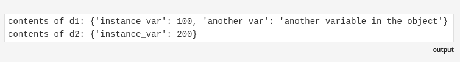

# `__dict__` property in python 

- The __dict__ property in Python is an attribute of objects that stores their namespace as a dictionary. It contains all the attributes and their values for an instance of a class. 

```python 
class Demo:
    def __init__(self, value):
        self.instance_var = value

d1 = Demo(100)
d2 = Demo(200)

d1.another_var = 'another variable in the object'

print('contents of d1:', d1.__dict__)
print('contents of d2:', d2.__dict__)
```



- [Refer q1.py]()