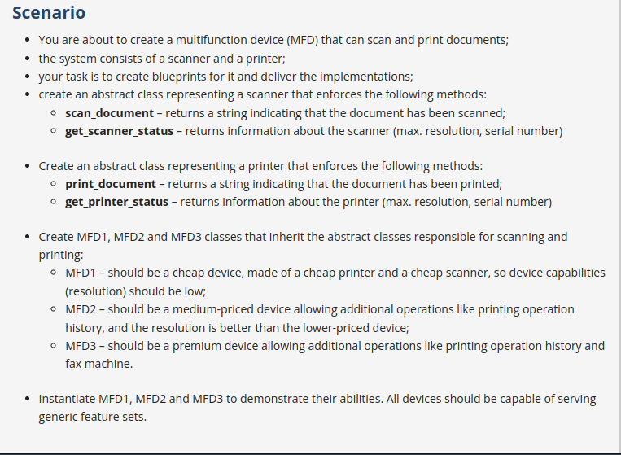

# Abstract Classes 

- An abstract class is a class, but not one you can create objects from directly. Its purpose is to define how other classes should look like, i.e. what methods and properties they are expected to have. 

- An abstract class in Python is a class that cannot be instantiated directly. When we say that abstract classes cannot be instantiated directly, it means you cannot create an object of an abstract class. Instead, you must create objects of subclasses that provide concrete implementations for all abstract methods declared in the abstract class.
 
```python 
    from abc import ABC, abstractmethod

    class Animal(ABC):

        @abstractmethod
        def make_sound(self):
            pass 

    myinstance01 = Animal() 
    # As you know that, an abstract class cannot be instntiated directly, this will raise an error 

```

- An Abstract class serves as a blueprint for other classes. 
- Abstract classes can contain abstract methods, which are methods declared without any implementation. Subclasses of the abstract class are expected to implement these abstract methods.

## ABC (Abstract base classes)

- Python has come up with a module which provides the helper class for defining **Abstract Base Classes (ABC)** and that module name is **`abc`**.
- The `ABC` class within the `abc` module is a helper class that allows you to define abstract base classes.
- A method becomes abstract by being decorated with an `@abstractmethod` decorator.


[Refer q1.py](./q1.py)

[Refer q2.py](./q2.py)


## Real world Project : Create a MFD(Multi-Functional Device) that scans and Prints the Documents 



## Answer: [Refer q3.py](./q3.py)