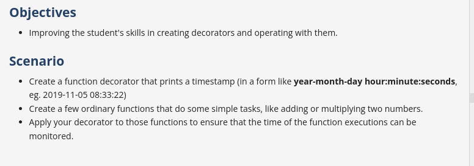

# Decorators in python 

- A decorator is one of the design patterns that describes the structure of related objects. Python is able to decorate functions, methods, and classes.
- The **decorator's** operation is based on wrapping the original function with a new "decorating" function (or class), hence the name "decoration". This is done by **passing the original function as a parameter to the decorating function** so that the decorating function can call the passed function. The decorating function returns a function that can be called later.
- Decorators are used to perform operations before and after a call to a wrapped object or even to prevent its execution, depending on the circumstances. As a result, we can change the operation of the packaged object without directly modifying it.


Decorators are used in:

    the validation of arguments;
    the modification of arguments;
    the modification of returned objects;
    the measurement of execution time;
    message logging;
    thread synchronization;
    code refactorization;
    caching.

[Refer q1.py](q1.py)


## @simple_decorator
- a simple decorator – a function which accepts another function as its only argument, prints some details, and returns a function or other callable object.

```python 
    def simple_decorator(function):
        print("We are about to call {}".format(function.__name__))
        return function

    @simple_decorator
    def simple_hello():
        print("Hello from simple function!")

simple_hello()    
```

[Refer q2.py](./q2.py)

[Refer q4.py](./q4.py)


## Decorators should be universal 
- When we say "decorators should be universal," we mean that the decorator should be capable of working with any function, regardless of the number and types of arguments that function accepts.
- This universality can be achieved by using the ***args** and ****kwargs** constructs, which allow the decorator to accept and pass through any number of positional and keyword arguments.


[Refer q3.py](./q3.py)


## Decorators can accept their own attributes 

- In Python, decorators can be made more flexible and universal by accepting arguments. This allows the same decorator to be used with different parameters, enhancing functionality without altering the core functions.

[Refer q5.py](./q5.py)

## Decorator Stacking 
- Decorator stacking is a technique in Python where multiple decorators are applied to a single function. This allows you to layer multiple functionalities or modifications on top of each other in a specific order.
- When you stack decorators, they are applied from the innermost (bottom) to the outermost (top) decorator. This means the decorator closest to the function is applied first, and the one farthest from the function is applied last.

[Refer q6.py](./q6.py)

## Project : Timestamp Logger 



[Refer q7.py](./q7.py)


## decorator function with classes

- Creating decorators using classes can provide more flexibility and encapsulation compared to function-based decorators.
- A class-based decorator typically defines a `__call__` method to make the instance callable, just like a regular function.
- Instead of wrapping individual methods with function decorators, class decorators are ways to manage classes or wrap special method calls into additional logic that manages or extends instances that are created.

[Refer q8.py](./q8.py)


## decorator with arguments 

-  class-based decorator with arguments in Python is a powerful tool for enhancing the functionality of functions or methods. It allows you to pass parameters to the decorator itself, enabling more flexible and reusable code. The decorator class should have an `__init__` method to accept arguments, and a `__call__` method to make the instance callable like a function.

steps: 

1. use `__init__` method to store the arguments passed to the decorator.
2. Implement the `__call__` method to define the logic that should be added to the decorated function.
3.  the `__call__` method, define and return a wrapper function that adds the desired behavior and calls the original function.

[Refer q9.py](./q9.py)

## function decorating a class 

- Decorating a class with a function-based decorator can be useful for adding or modifying the behavior of class methods, injecting properties, or modifying the class itself.
- function-based decorators can be useful for scenarios where you want to apply the same decorator logic to both functions and classes, or when you want to create more flexible and reusable decorators.

[Refer q10.py](./q10.py)


