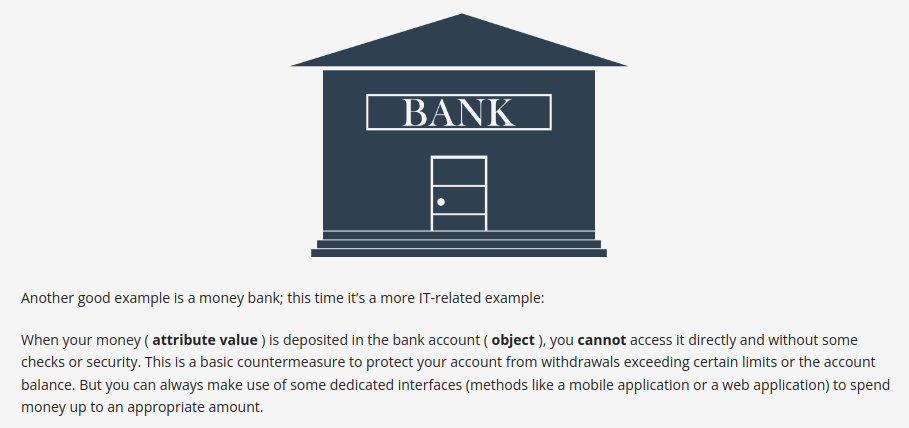
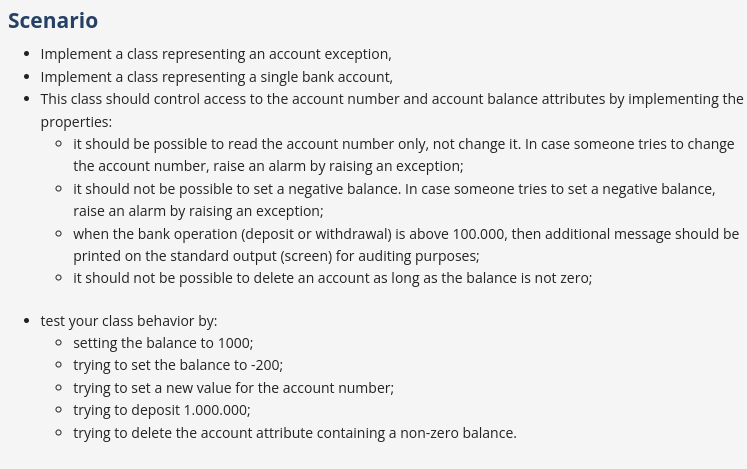

# Encapsulation in Python 

- Encapsulation in Python is the bundling of data (attributes) and methods (functions that operate on the data) that manipulate the data into a single unit, known as a class.
- It describes the idea of bundling attributes and methods that work on those attributes within a class.
- Encapsulation is used to hide the attributes inside a class like in a capsule, preventing unauthorized parties' direct access to them. Publicly accessible methods are provided in the class to access the values, and other objects call those methods to retrieve and modify the values within the object. This can be a way to enforce a certain amount of privacy for the attributes.
- Python introduces the concept of properties that act like proxies to encapsulated attributes.

- Python allows you to control access to attributes with the built-in `property()` function and corresponding decorator `@property`.

## Real world Project: Create a Bank Account Management System

Design a Python class for managing bank accounts with custom exceptions, properties to control access to account details, and rules for setting and deleting balances. Implement and test this class to handle account number protection, prevent negative balances, and enforce auditing for large transactions.

## Answer: [Refer q3.py](./q3.py)