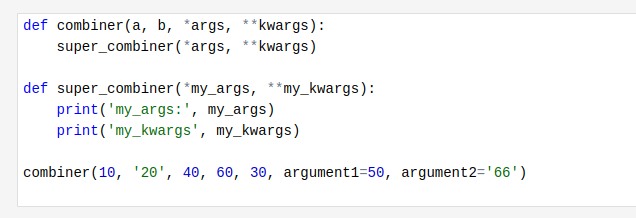
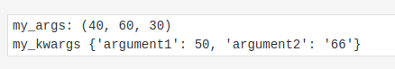

# Extended function argument syntax 

- Extended function argument syntax in Python allows for more flexible and readable function definitions and calls.
- It includes several features such as positional arguments, keyword arguments, default values, *args, **kwargs, and keyword-only arguments.
- These two special identifiers (named *args and **kwargs) should be put as the last two parameters in a function definition. Those two special parameters are responsible for handling any number of additional arguments (placed next after the expected arguments) passed to a called function.

### **Types of Arguments**:

1. Positional arguments
- These are the most straightforward and are matched in order.

```python
def func(a, b, c):
    print(a, b, c)

func(1, 2, 3)  # Outputs: 1 2 3
```

2. Default Arguments
- You can provide default values for arguments, which makes them optional when calling the function.

```python
def func(a, b=2, c=3):
    print(a, b, c)

func(1)      # Outputs: 1 2 3
func(1, 4)   # Outputs: 1 4 3
```

### `*args`

- if refers to a tuple of all additional, not explicitly expected positional arguments, so arguments passed without keywords and passed next after the expected arguments. 
- In other words, `*args` collects all unmatched positional arguments.
- The single asterisk is used to denote **variable-length positional arguments**. 
- When a function uses `*args`, it can accept any number of positional arguments, which are then passed to the function as a **tuple**.

### `**kwargs`
- It refers to a dictionary of all unexpected arguments that were passed in the form of keyword=value pairs. Likewise, `**kwargs` collects all unmatched keyword arguments.
- The double asterisk is used to denote **variable-length keyword arguments**.
- When a function uses `**kwargs`, it can accept any number of keyword arguments, which are then passed to the function as a **dictionary**.

In Python, asterisks are used to denote that args and kwargs parameters are not ordinary parameters and should be unpacked, as they carry multiple items.

-----

*args refers to a tuple of all not explicitly expected arguments; **kwargs refers to a dictionary of all not explicitly expected keyword arguments
```python 
def combiner(a, b, *args, **kwargs):
    print(a, type(a))
    print(b, type(b))
    print(args, type(args))
    print(kwargs, type(kwargs))


combiner(10, '20', 40, 60, 30, 445, argument1=50, argument2='66')
```

[Refer q1.py](./q1.py)

Forwarding arguments to other functions 





- [Refer q2.py](./q2.py)
- [Refer q3.py](./q3.py)
