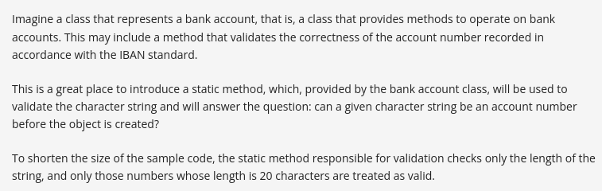
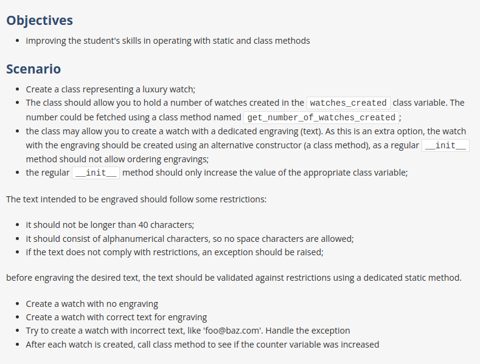

# Mangling the attribute 

- In Python, **attribute privacy** is a matter of convention rather than strict enforcement by the language itself. The use of double underscores (`__`) at the beginning of an attribute name in a class is a convention to name-mangle the attribute, effectively making it harder to access directly from outside the class. This is often referred to as name **mangling**.

- when you define any attribute with `__` double underscores in the start of the attribute name, it becomes the private attribute. 
- when you define any attribute with `_` single underscore in the start of the attribute name, it becomes the protected attribute. 

# Instance Methods

- Instance methods in Python are functions defined within a class that operate on instances (objects) of that class. These methods are associated with an instance of the class and can access and modify instance attributes.

Program 1 : 

```python

    class Car:
        def __init__(self, make, model):
            self.make = make
            self.model = model
            self.mileage = 0

        def drive(self, miles):
            self.mileage += miles

        def display_info(self):
            return f"{self.make} {self.model}, Mileage: {self.mileage} miles"


    # Creating instances of the Car class
    car1 = Car('Toyota', 'Camry')
    car2 = Car('Honda', 'Accord')

    # Calling instance methods on each instance
    car1.drive(100)
    car2.drive(50)

    # Displaying information using instance methods
    print(car1.display_info())  # Output: Toyota Camry, Mileage: 100 miles
    print(car2.display_info())  # Output: Honda Accord, Mileage: 50 miles

```

Program 2 : [Refer q1.py](./q1.py)

`self.__internal` : self.__internal is a **private instance variable (also known as a private attribute)** in Python. It's conventionally used to denote that this attribute should not be accessed directly from outside the class. Python does not have true private members, but using a double underscore prefix (`__`) causes Python to name-mangle the attribute, making it harder to access from outside the class. The use of `self.__internal` as a private attribute in your `Example` **class** is to encapsulate data within the class and restrict direct access from outside the class


You cannot access the private attribute outside the class : [Refer q2.py](./q2.py)

# Class Methods

- In Python, class methods are methods that are bound to the class rather than to instances of the class. They can be called on either the class itself or on instances of the class. 
- Class methods are defined using the @`classmethod` **decorator**.
- In Python, `@classmethod` is a decorator used to define a method within a class that operates on the class itself rather than on instances of the class. This means that class methods have access to the class itself.
- In Python, `cls` is a conventional name used as the first parameter of a class method. It stands for "**class**" and is similar to how `self` is conventionally used as the first parameter of instance methods.
- The `cls` parameter allows you to access class-level variables and methods within the class method.

[Refer q3.py](./q3.py)

[Refer q4.py](./q4.py)

# Static Methods 

- In Python, a static method is a method that belongs to a class but does not operate on an instance or the class itself.
- Static methods do not take the self or cls parameters. Instead, they behave like regular functions that are scoped within a class, providing a namespace.
- Static methods are defined using the `@staticmethod` decorator.

[Refer q5.py](./q5.py)

### Question: Validating iban number 


### Answer: [Refer q6.py](./q6.py)


# Project 


## Answer : [Reference q7.py](./q7.py)