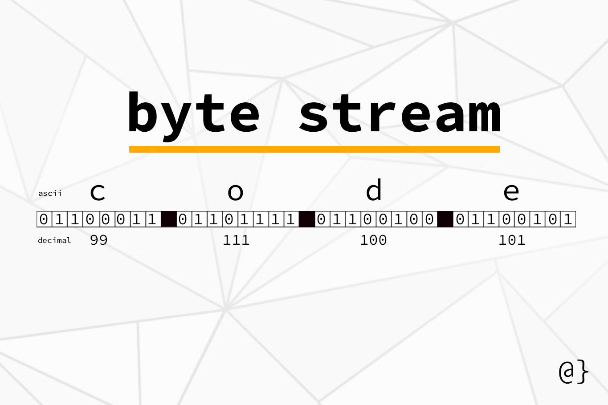

# Serialization in python using pickle module

- Serialization is the process of converting a Python object into a byte stream, and deserialization is the reverse process. 

### Serializing an Object
- To serialize an object, you can use `pickle.dump()` or `pickle.dumps()`, former serializes the object to a file, while the latter serializes the object to a bytes object.
- `pickle.dumps(object_to_be_pickled)` – expects an initial object, returns a byte object. This byte object should be passed to a database or network driver to persist the data;
- Remember that attempts to pickle non-pickleable objects will raise the `PicklingError` exception.


```python
import pickle

# Define the data
data = {'name': 'Alice', 'age': 23, 'city': 'New York'}

# Serialize the data to a file
with open('data.pkl', 'wb') as file:
    pickle.dump(data, file)

```

### Deserializing an Object

- To deserialize an object, you can use `pickle.load()` or `pickle.loads()`. The former deserializes an object from a file, while the latter deserializes an object from a bytes object.
- `pickle.loads(bytes_object)` – expects the bytes object, returns the initial object.

```python
# Open the file in binary read mode
with open('data.pkl', 'rb') as file:
    loaded_data = pickle.load(file)

print(loaded_data)
```


1. **Import the pickle Module**: The pickle module is imported to enable serialization and deserialization of Python objects.

2. **Define a Dictionary**: A dictionary named data is created with keys '**name**', '**age**', and '**city**'.

3. **Open a File in Binary Write Mode**: The file `data.pkl` is opened in binary write mode ('wb'). If the file does not exist, it will be created.

4. **Serialize the Dictionary**: The `pickle.dump(data, file)` function call serializes the data dictionary and writes it to the file `data.pkl`.

### Why serilization is used in python 

1. **Persisting Data**

    Serialization allows you to save the state of an object to a file, so it can be stored and later retrieved. This is useful for applications that need to save user settings, application state, or any other kind of data between runs.

2. **Data Exchange**

    Serialized data can be easily shared and transmitted between different parts of a program, different programs, or even different machines over a network. This is crucial for distributed systems, web services, and APIs.

    example, A web service might serialize data to JSON (another serialization format) to send it over HTTP to a client.


3. **Caching**
    Serialization can be used to cache expensive computations. Once the data is computed, it can be serialized and saved. Subsequent requests can load the serialized data instead of recomputing it

4. **Inter-process Communication**

    Serialization can be used for communication between different processes. Objects can be serialized to a byte stream and sent through pipes, sockets, or shared memory.

5. **Clone Objects**

    Serialization can be used to create deep copies of objects. By serializing and then deserializing an object, you create a new object with the same data but different references.

## Byte Stream 

- A byte stream is a sequence of bytes, which are units of digital information typically consisting of eight bits. 
- In the context of serialization, a byte stream represents the serialized form of an object, containing all the data and metadata necessary to recreate the object in memory when deserialized.



### Uses of Byte Streams
1. **File I/O**: Reading from or writing to binary files.
2. **Network Communication**: Sending and receiving data over a network in a serialized format.
3. **Inter-process Communication**: Sharing data between different processes or systems.
 