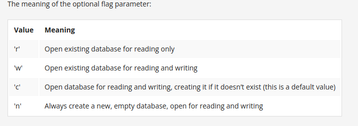

# What is Object Persistence ?

Object persistence refers to the ability of an object to outlive the program execution that created it. In other words, it is the concept of storing an object's state in a non-volatile storage medium, such as a file or a database, so that it can be retrieved and used in future executions of the program. This allows the data encapsulated by the object to persist beyond the runtime of the application, making it possible to save and restore the state of an object.


# Serialization of Python objects using the shelve module

- The Shelve Module of Python is a very popular module of Python which works like an effective tool for persistent data storage inside files using a Python program. As the name of this module suggests, i.e., Shelve, we can easily interpret that it will work as a shelf object to keep all our data inside a file and save all the necessary information. In the Shelve Module, a shelf object is defined, which acts like a dictionary-type object, and it is persistently stored in the disk file of our computer. That's how we can save all the data and information through Python Shelve Module in our system and keep it till whenever we want.

- The shelf file created by shelve may have additional files with extensions like `.bak`, `.dat`, and `.dir` depending on the underlying database module used (like dbm).


```python 
import shelve

shelve_name = 'first_shelve.shlv'

my_shelve = shelve.open(shelve_name, flag='c')
my_shelve['EUR'] = {'code':'Euro', 'symbol': '€'}
my_shelve['GBP'] = {'code':'Pounds sterling', 'symbol': '£'}
my_shelve['USD'] = {'code':'US dollar', 'symbol': '$'}
my_shelve['JPY'] = {'code':'Japanese yen', 'symbol': '¥'}

my_shelve.close()

new_shelve = shelve.open(shelve_name)
print(new_shelve['USD'])
new_shelve.close()

```


