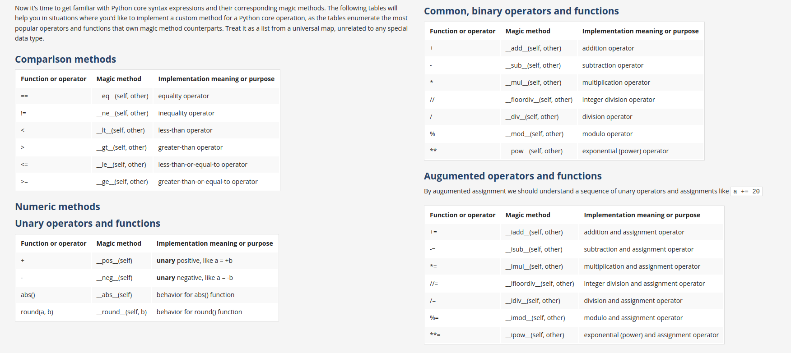
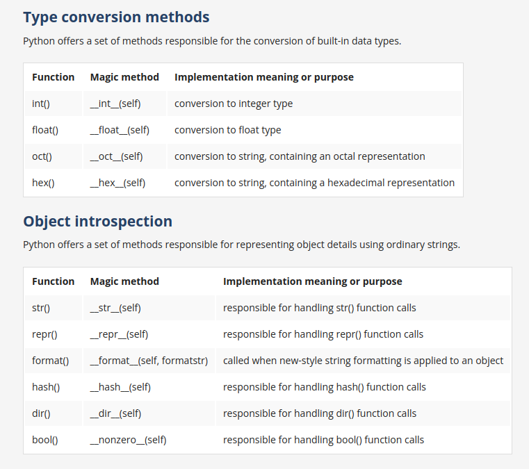
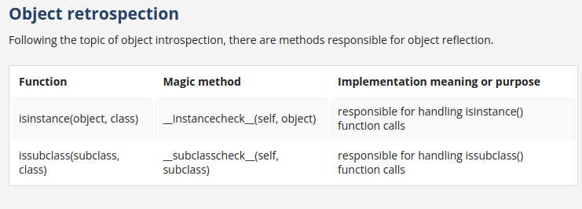
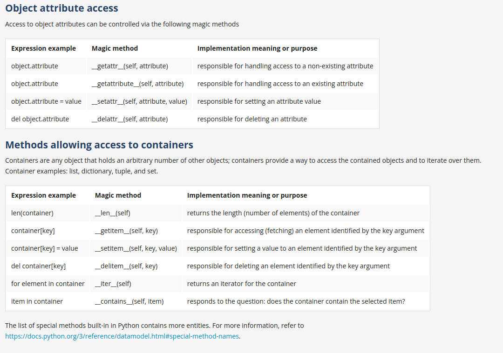
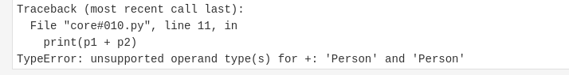
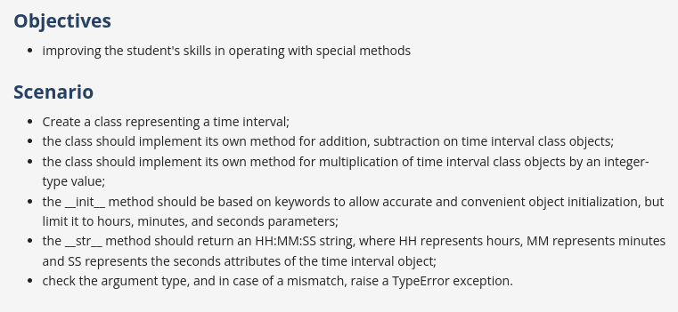

# Python core syntax






- operators like '+', '-', '*', '/', '%' and many others;
- operators like '==', '<', '>', '<=', 'in' and many others;
- indexing, slicing, subscripting;
- built-in functions like str(), len()
- reflexion – isinstance(), issubclass()

## __add__() method 

```python
number = 10
print(number.__add__(20))
```

```python
mystring = 'abc'
print(mystring.__add__('def'))
```

[Refer q1.py](./q1.py)

- Now the below code will cause an error, because python does not know how to perform addition on the two Person class objects.

```python
class Person:
    def __init__(self, weight, age, salary):
        self.weight = weight
        self.age = age
        self.salary = salary
p1 = Person(30, 40, 50)
p2 = Person(35, 45, 55)

print(p1 + p2)

```



- you have to use `__add__()` method for adding the two instance object values.
- Pay attention to the fact that the `__add__()` method does not change any object attribute values – it just returns a value that is the result of adding the appropriate attribute values.
- [Refer q2.py](./q2.py)


## dir() method 

- The `dir()` function in Python is used to get a list of the attributes and methods of any object (modules, functions, strings, lists, dictionaries, etc.). When no argument is passed, it returns the list of names in the current local scope.

```python
s = "hello"
print(dir(s))
```

[Refer q3.py](./q3.py)

## Question 



### Solution: [Refer q4.py](./q4.py)