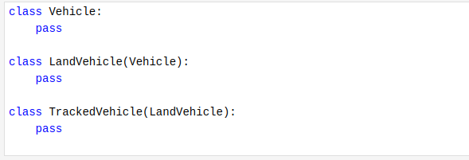
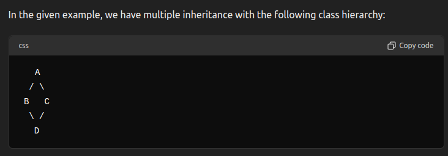
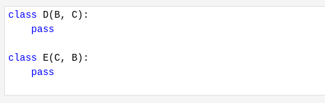
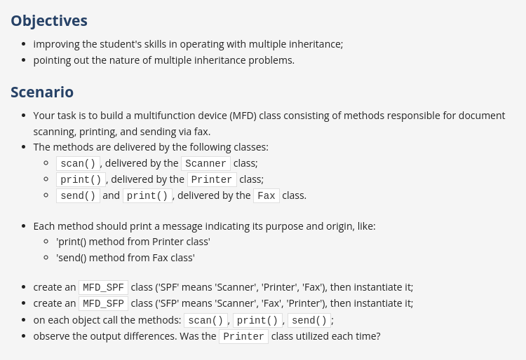

# Inheritance 

- Inheritance creates a class hierarchy. Any object bound to a specific level of class hierarchy inherits all the traits (methods and attributes) defined inside any of the superclasses.
- Each subclass is more specialized (or more specific) than its superclass. Conversely, each superclass is more general (more abstract) than any of its subclasses.
- A class which is derived from more than one superclass is considered as **multiple inheritance**. 

## MRO (Method Resolution Order)

- In Python, the Method Resolution Order (MRO) is a rule that determines the order in which base classes are searched when executing a method. This is particularly important in the context of multiple inheritance. 

[Refer q1.py](./q1.py)

- Due to MRO, you should knowingly list the superclasses in the subclass definition. In the following example, class D is based on classes B and C, whereas class E is based on classes C and B (the order matters!)

- the order matters while inheriting the superclass, those classes can behave totally differently, because the order of the superclasses is different. 

    [Refer q2.py](./q2.py)

    ### Question 

    

    [Refer q3.py](./q3.py)

# Polymorphism 

- In Python, polymorphism is the provision of a single interface to objects of different types.
- Polymorphism lets us define methods in the child class that have the same name as the methods in the parent class.
- In programming, polymorphism means the same function name (but different signatures) being used for different types.
- The key difference is the data types and number of arguments used in function.

[Refer q4.py](./q4.py)

[Refer q5.py](./q5.py)