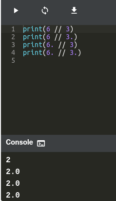

# Basic Operators 

1. Arithmetic Operators
- Just as any other programming languages, the addition, subtraction, multiplication, and division operators can be used with numbers.
- Using two multiplication symbols makes a power relationship.
- Python supports concatenating strings using the addition operator.
- Python also supports multiplying strings to form a string with a repeating sequence.
- Lists can be joined with the addition operators.
- Just as in strings, Python supports forming new lists with a repeating sequence using the multiplication operator:

2. Floor Division 
- A // (double slash) sign is an integer division operator where the results are always rounded.

