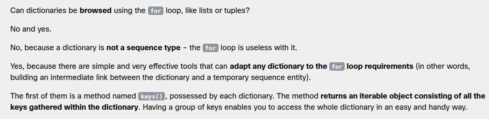
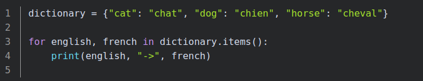
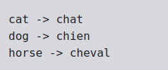

# Dictionaries in python 

- The dictionary is another Python data structure. It's not a sequence type (but can be easily adapted to sequence processing) and it is mutable.

## `keys()` method 

[refer q2.py](./q2.py)

## `items()` method 

The method returns tuples (this is the first example where tuples are something more than just an example of themselves) where each tuple is a key-value pair.

[refer q3.py](./q3.py)

## `values()` method

There is also a method called values(), which works similarly to keys(), but returns values.

[refer q4.py](./q4.py)

## Adding a new key

- Adding a new key-value pair to a dictionary is as simple as changing a value – you only have to assign a value to a new, previously non-existent key.
- Note: this is very different behavior compared to lists, which don't allow you to assign values to non-existing indices.

[refer q5.py](./q5.py)

## `update()` method 

- You can also insert an item to a dictionary by using the update() method

[refer q6.py](./q6.py)

## Removing a key

- removing a key will always cause the removal of the associated value. Values cannot exist without their keys.
- This is done with the del instruction.

[refer q7.py](./q7.py)

- To remove the last item from the dictionary

[refer q8.py](./q8.py)

