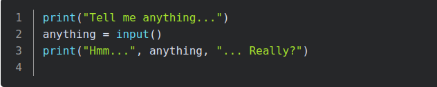
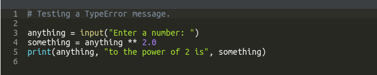
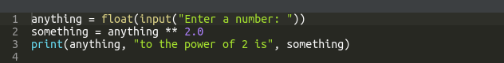

# input() function

- The input() function is able to read data entered by the user and to return the same data to the running program.

## you can't do this, this is prohibited 

There is a typeerror.

The last line of the sentence explains everything ‒ you tried to apply the ** operator to 'str' (string) accompanied with 'float'

##  Type casting (type conversions) in input() function

