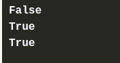

# Lists
- Lists are very similar to arrays. They can contain any type of variable, and they can contain as many variables as you wish. Lists can also be iterated over in a very simple manner.
- Operations you can perform on lists: 
    - append : add element in the end of the list 
    - delete : delete any specified element from the list 
    - len : count the number of elements in the list
    - insert : can add a new element at any place in the list, not only at the end

## Negative Indices in Lists 
- It may look strange, but negative indices are legal, and can be very useful.
- An element with an index equal to `-1` is the last one in the list.
- An element with an index equal to `-2` is the one before last in the list.
- [Refer q4.py](./q4.py)

## Swap in python

- This is the traditional method you can use : 

- Python offers a more convenient way of doing the swap – take a look:

- you can easily swap the list's elements to reverse their order:

## referencing in python 

- When you assign one list to another, such as list_2 = list_1, you are not creating a new copy of the list. Instead, you are creating a **new reference** to the same list in memory. 

## Powerful slices 

- A slice is an element of Python syntax that allows you to make a brand new copy of a list, or parts of a list.
- It actually copies the list's contents, not the list's name.

- This inconspicuous part of the code described as [:] is able to produce a brand new list.
- [refer q8.py](./q8.py)

One of the most general forms of the slice looks as follows:

[refer q9.py](./q9.py)

### Negative slices 

### delete in slices 

Deleting all the elements at once is possible too:

Removing the slice from the code changes its meaning dramatically. Take a look: 

## `in` and `not in` operators 

- Python offers two very powerful operators, able to look through the list in order to check whether a specific value is stored inside the list or not.

## some examples of lists

- [refer q14.py](./q14.py)