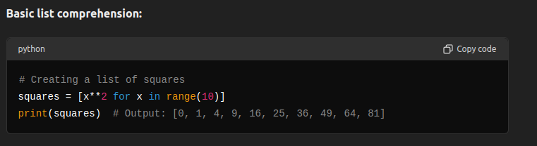
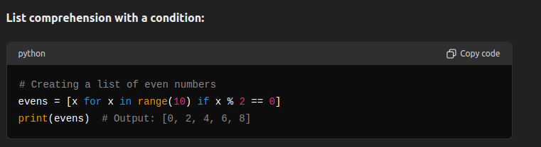
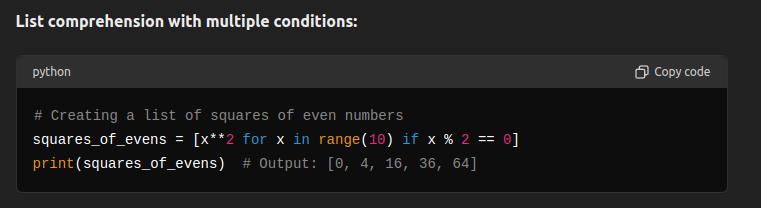

# Lists in Advance Application 

## Lists in 2-dimensional arrays 
- In Python, a 2-dimensional array can be represented using a list of lists. This is useful for representing matrices, grids, or tables.
- [refer q1.py](./q1.py)

## Lists in Multi-dimensional arrays
- For more than 2 dimensions, you can continue nesting lists. However, as the number of dimensions increases, managing these lists can become cumbersome. For higher-dimensional arrays, it's often beneficial to use libraries like NumPy, which is designed for numerical computations and provides efficient array operations.
- [refer q2.py](./q2.py)

## Lists Comprehensions 
- List comprehensions provide a concise way to create lists. They are often used to apply an expression to each element in a sequence or to filter elements from a sequence.

[Refer q3.py](./q3.py)

 

[Refer q4.py](./q4.py)

[Refer q5.py](./q5.py)

