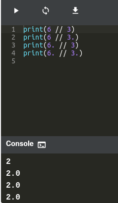
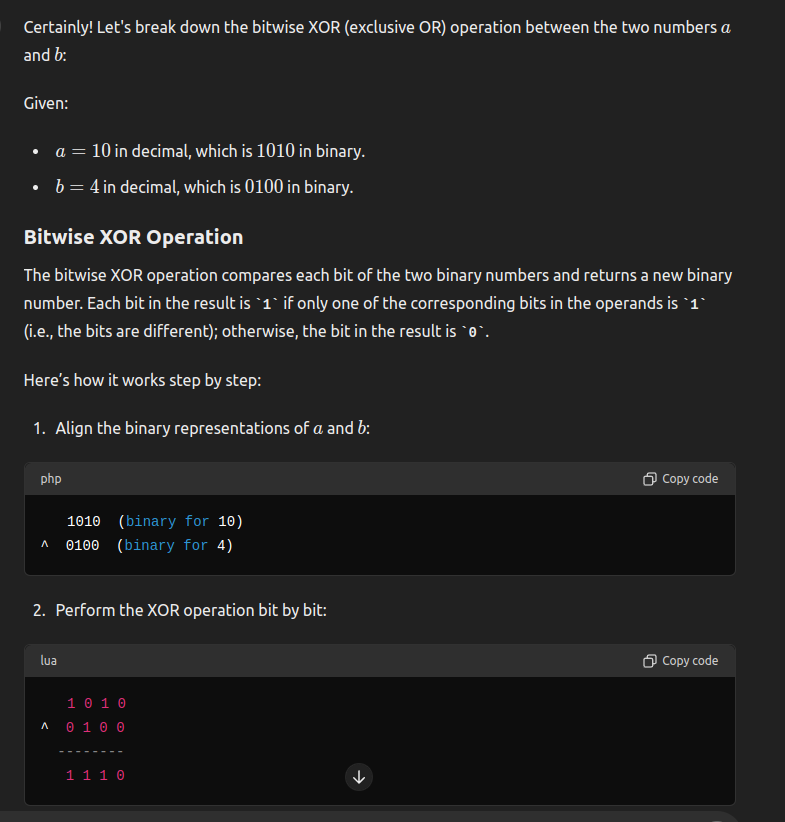
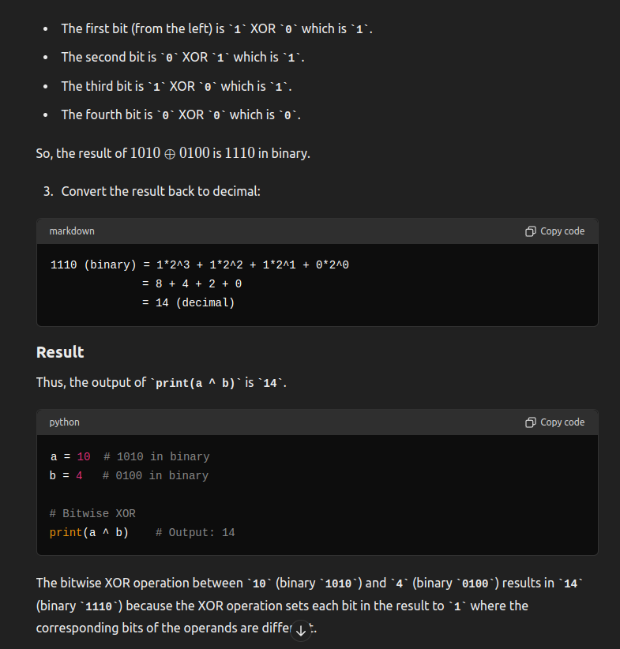

# Basic Operators 

## Arithmetic Operators
- Just as any other programming languages, the addition, subtraction, multiplication, and division operators can be used with numbers.
- Using two multiplication symbols makes a power relationship.
- Python supports concatenating strings using the addition operator.
- Python also supports multiplying strings to form a string with a repeating sequence.
- Lists can be joined with the addition operators.
- Just as in strings, Python supports forming new lists with a repeating sequence using the multiplication operator:


### Floor Division 
- A // (double slash) sign is an integer division operator where the results are always rounded.




## Equal to Operator (==)

- [Refer q2.py](q2.py)

```python
var = 1
print(var == 0)

```

## Not equal to operator (!=)
```python
var = 1
print(var != 0)

```

## Comparison Operators
 
- Python supports the usual logical Logical from mathematics. These conditions can be used in several ways, most commonly in "if statements" and loops.

        Equals: a == b
        Not Equals: a != b
        Less than: a < b
        Less than or equal to: a <= b
        Greater than: a > b
        Greater than or equal to: a >= b


## Logical Operators

- Logical operators are used to combine conditional statements. They operate on boolean values and return a boolean result.

        and: Returns True if both operands are true.
        or: Returns True if at least one operand is true.
        not: Returns True if the operand is false

- [Refer q4.py](q4.py)


## Bitwise operators 

- Bitwise operators are used to perform operations on binary representations of integers.
- [Refer q5.py](q5.py)

        & (AND): Performs bitwise AND.
        | (OR): Performs bitwise OR.
        ^ (XOR): Performs bitwise XOR.
        ~ (NOT): Performs bitwise NOT (inversion).
        << (Left Shift): Shifts bits to the left.
        >> (Right Shift): Shifts bits to the right

### XOR Operation 






### Left shift (<<) and right shift (>>)

- The bitwise right shift operation (>>) shifts the bits of the number to the right by the specified number of positions. Bits shifted out from the right are discarded, and new bits coming in from the left are set to 0.
- The bitwise left shift operation (<<) shifts the bits of the number to the left by the specified number of positions. Bits shifted out from the left are discarded, and new bits coming in from the right are set to 0.
- [Refer q6.py](q6.py)

