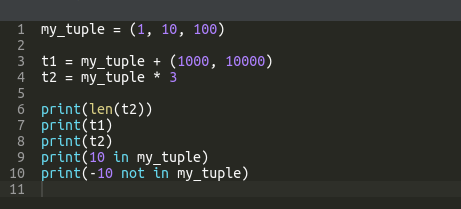
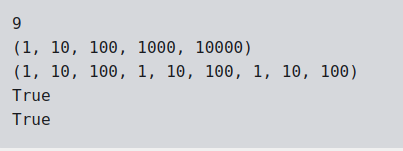

# Tuples in Python

-  A tuple is an immutable sequence type.
- The first and the clearest distinction between lists and tuples is the syntax used to create them - tuples prefer to use parenthesis, whereas lists like to see brackets
- Although it's also possible to create a tuple just from a set of values separated by commas.

        tuple_1 = (1, 2, 4, 8)
        tuple_2 = 1., .5, .25, .125
        

- If you want to get the elements of a tuple in order to read them over, you can use the same conventions to which you're accustomed while using lists.

        my_tuple = (1, 10, 100, 1000)

        print(my_tuple[0])
        print(my_tuple[-1])
        print(my_tuple[1:])
        print(my_tuple[:-2])

        for elem in my_tuple:
            print(elem)

- What else can tuples do for you?

    - the len() function accepts tuples, and returns the number of elements contained inside;
    - the + operator can join tuples together (we've shown you this already)
    - the * operator can multiply tuples, just like lists;
    - the in and not in operators work in the same way as in lists.

